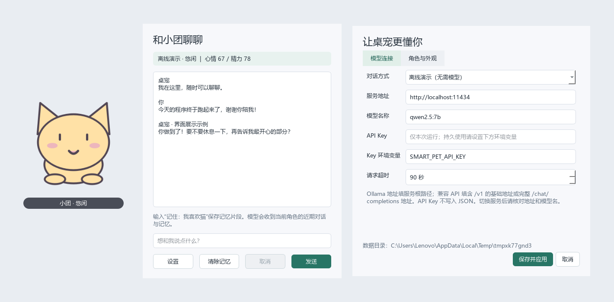

# SmartDesktopPet

面向 Windows 的模块化智能桌宠项目，采用 **Python 3.11+ / PySide6 / JSON**。这是可以启动、测试和继续开发的 MVP 框架；默认离线演示无需模型或密钥。



## 立即运行

在本项目目录打开 PowerShell：

```powershell
python -m venv .venv
.\.venv\Scripts\python.exe -m pip install -r requirements.txt
.\.venv\Scripts\python.exe run.py
```

如果当前 Python 已安装 PySide6，可以直接运行 `python run.py`。首次启动显示桌宠，单击桌宠打开聊天，右键桌宠或系统托盘图标打开菜单。Windows 可能把托盘图标放在任务栏的折叠菜单中。

开发环境一键准备并启动：

```powershell
powershell -ExecutionPolicy Bypass -File scripts/dev.ps1
```

`-ExecutionPolicy Bypass` 仅作用于这次脚本进程。也可直接逐行执行脚本里的命令。项目没有自动安装或启动 Ollama。

## 已实现的功能

- 透明、无边框、置顶桌宠窗口；鼠标拖拽、单击摸摸并聊天，保存位置，启动时把窗口限制在可见屏幕区域。
- 奶油猫“小团”和月光兔“小月”；每个内置角色包含 idle / happy / angry / sleepy 四组各 12 帧的程序绘制动画，带眨眼、呼吸和状态表情。美术为项目占位素材。
- 图片导入：PNG / JPG / WebP 自动生成独立角色包，四组各 8 帧基础运动动画；背景保留，推荐透明 PNG。**没有自动抠图、姿态补画或生成式视频能力**。
- Ollama、OpenAI 兼容 Chat Completions、离线演示三种对话方式；异步网络、绝对超时、取消、错误提示、响应大小限制。
- 独立人设、心情值、精力值、情绪状态机；对话和时间影响状态，动画随状态变化。当前情感判断为可替换的关键词规则，不是语义情感模型。
- 托盘显示/隐藏、聊天、设置、退出；隐藏时暂停动画。关闭聊天/设置不会退出桌宠。
- GUI 修改模型地址、模型名、会话密钥、超时、人设、动画速度和不透明度；切换角色、导入图片。
- JSON 保存配置、分角色近期对话、显式记忆片段、情绪和位置；原子替换、损坏备份、同数据目录单实例保护。

## 连接模型

### Ollama

先自行安装并启动 Ollama，确认本机已有需要使用的模型。例如已安装 Ollama 后，可以拉取项目示例模型：

```powershell
ollama pull qwen2.5:7b
```

如果后台服务没有启动，再运行 `ollama serve`。实际模型选择取决于机器内存/显存；设置中的名称必须与本机 `ollama list` 对应。

在设置 → 模型连接中选择“本地 Ollama”，地址填 `http://localhost:11434`，模型填本机模型名，保存后聊天。适配器发送非流式 `POST /api/chat`。

### OpenAI 兼容服务

选择“OpenAI 兼容 API”，地址填供应商提供的基础地址，例如 `https://api.openai.com/v1`；填写该服务实际支持的模型名。也支持填写完整的 `/chat/completions` URL，网关自定义前缀会保留。

API Key 可在设置中输入，仅保留于本次进程；推荐启动前设置环境变量：

```powershell
$env:SMART_PET_API_KEY = '填写你自己的密钥'
python run.py
```

设置中的“Key 环境变量”指定读取哪个变量。会话输入优先于环境变量；清空会话输入后恢复读取环境变量。更改环境变量后需要重启已运行的程序。

兼容接口使用 `model`、`messages`、`stream: false`，读取 `choices[0].message.content`。不依赖 OpenAI SDK；特定供应商额外参数可以在独立适配器里添加。当前未实现流式输出、工具调用或自动重试。演示模式只验证界面流程，回复是固定文本。

## 数据与记忆

默认数据目录为 `%APPDATA%\SmartDesktopPet`，与程序安装位置分离：

```text
SmartDesktopPet/
  config.json           # 模型参数、各角色人设、外观、窗口位置
  memory.json           # 各角色情绪、近期对话与记忆片段
  characters/           # 用户导入的角色包
  app.log               # 应用启动和异常日志，不记录正常聊天/API Key
  app.lock              # 同目录单实例锁
```

需要使用独立测试目录时运行：

```powershell
python run.py --data-dir ./local-data --demo
```

也支持 `SMART_PET_DATA_DIR` 环境变量。`--demo` 会切换并保存为演示模式；正式使用可在设置中改回模型服务。

每个角色最多保存 20 轮成功对话、12 条记忆片段。记忆文件总预算为 4 MB，超过时优先删除最早的对话，必要时裁剪片段。以“记住：”或“记住:”开头的消息在成功回复后加入片段；请求失败或取消不写入记忆。模型上下文包含人设、当前情绪、片段和最多 8 轮近期对话，并按约 16000 字符限制裁剪历史；这是字符预算，不是精确 token 预算。设置会限制人设 4000 字符，单次输入 2000 字符。

切换角色时人设与记忆独立恢复，未完成的旧请求会取消。清除记忆仅影响当前角色的对话和片段，保留人设、情绪。状态每 30 秒、成功对话后、应用设置时和正常退出时保存。配置与记忆分别原子写入，不构成跨文件数据库事务；断电可能丢失最近一个保存周期的情绪变化。

记忆 JSON 为本地明文。选用远程服务时，当前角色用于生成回复的上下文会发送到该地址。API Key 不进入配置文件、角色包或常规日志。

## 项目结构

```text
src/smart_desktop_pet/
  app.py                 # CLI 参数、QApplication、日志、单实例锁
  controller.py          # 组装模块、调度交互、管理生命周期
  domain/emotion.py      # 无 Qt 依赖的情绪状态机
  rendering/             # 帧播放器、透明窗口、鼠标交互
  characters/            # 内置占位美术、帧清单、图片导入
  ai/                    # Provider 协议、双接口、上下文、异步网络
  memory/                # 分角色对话与情绪存储
  config/                # 配置模型、校验、原子 JSON 存储
  system/                # 系统托盘适配器
  ui/                    # 聊天/设置对话框和样式
tests/                   # 状态机、持久化、HTTP 替身与 GUI 集成测试
scripts/                 # 开发、构建和真实组件预览脚本
docs/                    # 架构、角色协议、开发计划、验收说明
```

进一步阅读：[架构设计](docs/ARCHITECTURE.md)、[八周开发计划](docs/ROADMAP.md)、[角色包协议](docs/CHARACTER_PACK.md)、[测试与验收](docs/TESTING.md)。

## 测试与打包

```powershell
.\.venv\Scripts\python.exe -m pip install -r requirements-dev.txt
.\.venv\Scripts\python.exe -m ruff check .
.\.venv\Scripts\python.exe -m pytest -q
powershell -ExecutionPolicy Bypass -File scripts/build.ps1
```

构建脚本调用 PyInstaller，产物为 `dist/SmartDesktopPet/SmartDesktopPet.exe`，分发时需要保留整个目录；不包含 Python 运行环境之外的模型权重、Ollama 服务或用户密钥。构建应在 Windows 上完成，不支持从其他系统直接交叉打包 Windows EXE。

已提供 Windows GitHub Actions 工作流，上传完整构建目录。签名、安装向导、自动更新和正式美术授权检查属于发布阶段；当前不是已签名的生产安装包。

## 两个月范围

优先稳定上述基础能力，再加入流式输出、角色美术、更多情绪规则和打包验收。语音、多模态、自动抠图/生成式动画、桌面操作插件、长期语义检索属于后续扩展，见开发计划。运行框架不会执行模型返回的代码或系统命令。

## 实现参考

- [Qt QWidget：透明窗口与窗口属性](https://doc.qt.io/qtforpython-6/PySide6/QtWidgets/QWidget.html)
- [Qt QSystemTrayIcon：托盘及菜单](https://doc.qt.io/qtforpython-6/PySide6/QtWidgets/QSystemTrayIcon.html)
- [Ollama Chat API](https://docs.ollama.com/api/chat)
- [OpenAI 官方 Chat API 文档](https://developers.openai.com/api/reference/resources/chat)
