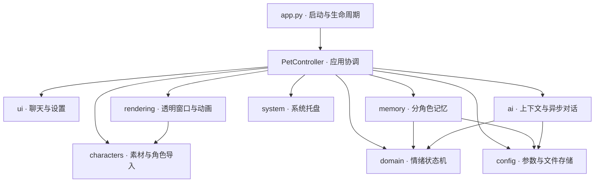

# SmartDesktopPet 架构设计

## 目标与边界

在两个月内完成 Windows 10/11 可运行、可测试、可打包的桌宠。选择单进程 Python + PySide6；GUI 与动画由 Qt 事件循环驱动，AI HTTP 请求使用 `QNetworkAccessManager` 异步传输，避免引入额外 asyncio/线程循环的协调成本。简单 JSON 足以覆盖当前配置和有限记忆规模。

目录以职责划分；不要求每个目录都是独立进程或独立发行包。模块之间通过小对象、配置快照和 Qt signals 协作，应用协调层负责组装。项目不引入全局事件总线、插件自动发现或向量库，等出现明确需求后再增加。

## 依赖关系

`domain` 无 Qt、HTTP、文件系统依赖。窗口只发送点击、拖动、聊天、设置等信号，不直接保存 JSON 或调用模型。托盘不持有模型或情绪对象。Provider 构造请求和解析响应，不管理 UI。当前 `memory` 复用 `config.storage` 的通用 JSON 存储函数；当引入 SQLite 时可将公共存储抽出为 infrastructure。

## 模块接口

- `EmotionMachine.tick(seconds) / pet() / hear(text)`：更新心情、精力并返回状态，阈值缓冲避免频繁切换。
- `CharacterCatalog.list() / load(character) / import_image(path, name)`：输出 `AnimationPack`，每个状态提供帧图像与 FPS。
- `Animator.load(pack) / configure(state, speed)`：通过 `frame_changed` 发出可绘制帧；隐藏窗口暂停计时器。
- `ChatProvider.request(config, messages) / parse(data)`：对齐不同服务协议；新服务只需实现协议并注册到 `PROVIDERS`。
- `ChatClient.send(...) / cancel()`：发出 `succeeded`、`failed`、`busy_changed`；一次只允许一个请求。
- `MemoryStore.profile() / remember() / checkpoint() / clear() / save()`：按角色 ID 隔离并限制存储容量。
- `ConfigStore.load() / save()`：验证配置；损坏时复制备份后返回默认值和警告。
- `PetController`：唯一跨模块协调者，负责对话提交、切换角色、应用设置、自动保存与退出。

## 对话时序

1. 输入框验证非空，协调层拒绝并发发送；保留输入用于失败重试。
2. 用情绪对象副本计算本次对话的状态，构建人设、情绪、记忆和近期上下文。
3. Provider 构造 URL 与非流式 JSON；Qt 发起异步请求，窗口和动画持续响应。
4. 成功后提交实际情绪、完整 user/assistant 对、显式记忆片段并保存 JSON。
5. 失败、超时、取消时只显示提示，不保存半轮对话；输入保留。
6. 切换设置或角色会使请求代次失效并取消网络回复，晚到结果无法写入另一角色。

内置演示回复明确标注“离线演示”，不调用网络。所有用户/模型输出用纯文本插入控件，不作为 HTML 解析。

## 情绪状态机

心情和精力取值为 0–100。困倦优先于生气，生气优先于开心，其余为 idle：

- 困倦：精力低于 25 进入，恢复到 40 才退出。
- 生气：心情低于 30 进入，恢复到 40 才退出。
- 开心：心情达到 70 进入，低于 60 才退出。
- 单击摸摸：心情 +4、精力 -1。
- 对话：正面关键词心情 +12，负面关键词 -18，否则 +1；精力 -2。休息/晚安关键词使精力降至最多 20。
- 时间：心情每分钟向 50 回归 1.2 点；清醒每分钟精力 -0.5，困倦每分钟恢复 4 点。

使用单调时钟计算在线经过时间，每次最多处理 5 分钟，避免系统休眠恢复后的巨大跳变；不模拟离线时段。规则集中在纯领域模块，可替换为更复杂的策略而不修改渲染。

## 角色与记忆

内置角色运行时生成可缓存的 QImage/QPixmap 帧。导入角色生成相同大小的 PNG 帧和 JSON manifest，正式美术可按同一协议直接替换，不需要修改 Animator。自定义包只允许包内路径，限制文件大小、图片尺寸、帧数与 FPS。

人设由 `config.personas[character_id]` 保存；近期对话、记忆片段、心情和精力保存在 `memory.characters[character_id]`。切换角色保存旧状态、加载新状态。默认两个角色拥有不同名字与人设。

当前“情绪记忆”含带时间和情绪标签的对话记录、持久化心情/精力及明确保存的片段；没有自动摘要或向量检索。整个记忆文件采用 4 MB 预算，超过时优先裁剪最早的对话，之后才裁剪片段，确保文件始终可被有大小限制的读取器恢复。上下文中的记忆来自用户，保留为用户消息，不提升为系统级指令。字符预算避免无界增长；不同模型的 tokenizer 和上下文容量仍需实际配置与验证。

## 文件可靠性与密钥

JSON 使用同目录临时文件、flush/fsync、`os.replace`；文件不可读或校验失败时备份为 `.broken-时间戳.json`，不会直接丢弃原件。连备份都失败时阻止启动，保留现场。版本号为 1，后续改结构应添加显式迁移器，不应依赖静默字段转换。

每个数据目录由 QLockFile 保护，防止两个进程同时写相同配置。配置和记忆是分别原子保存；不承诺跨文件事务。控制器每 30 秒及关键操作后保存，异常断电仍可能丢失最近状态。

API Key 从环境变量或会话内存读取，不写 JSON。禁止带账户密码、查询参数的服务 URL，HTTP 重定向不自动跟随；服务原始错误体不直接显示。当前本地 Ollama 可使用 HTTP，远程服务应使用供应商 HTTPS 地址。日志不记录正常消息和请求头。

## 扩展位置

- 流式输出：扩展 `ChatClient` 的协议增量解析并新增文本片段信号，保留完整成功后才持久化的规则。
- 自动摘要/检索：替换 `MemoryStore` 与 `build_messages`，保持角色 ID 隔离。
- 更多情绪与行为：扩展 `Emotion` 和状态规则，为角色清单增加新状态或明确 fallback。
- 图片生成/抠图：在 `characters` 前增加资产生成适配器；输出继续遵循角色包协议。
- 音频：增加 `audio` 模块，不把录音、识别或合成放进 QWidget。
- 提醒、日程等插件：先定义受控命令协议和权限边界，禁止直接执行模型返回的代码。
- 数据规模增大：把记忆迁至 SQLite，同时保留 JSON 配置及导出接口。

## 仍需真实环境验收

离屏测试可以验证 Qt 控件行为与图像，但不能证明 Windows 桌面合成透明度、托盘交互、多显示器跨 DPI 行为和打包后的启动可靠性。真实 Ollama/兼容服务还涉及模型安装、凭据、网络与供应商参数。对应验收场景见 TESTING.md。
